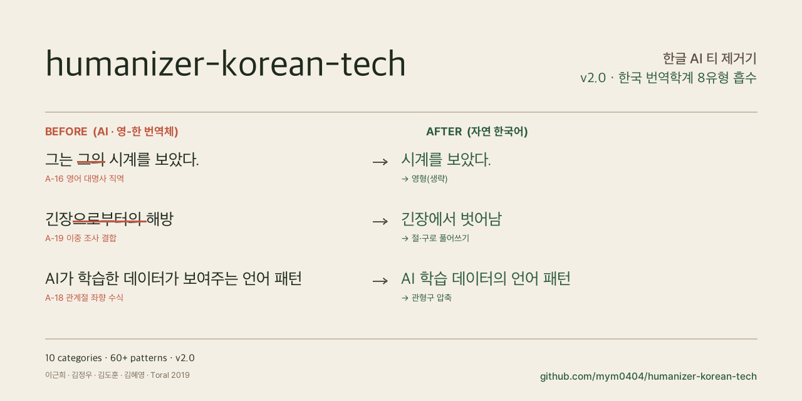

<p align="center">
  
</p>

# Humanize KR — Korean Tech Writing Fork

AI(ChatGPT, Claude, Gemini 등)가 쓴 한글 글에서 AI 티를 줄이고, 문체와 리듬을 자연스러운 한국어로 다듬는 Claude Code/Codex용 스킬입니다.

이 fork는 upstream humanizer의 의미 보존 윤문 파이프라인에 Toss Technical Writing의 문장 중심 원칙 일부를 병합했습니다. 문서 목적, 제목 품질, 섹션 구조 같은 문서 설계 규칙은 다루지 않고, 문장 안에서 실제 동작을 흐리는 표현을 줄이는 데 집중합니다.

## 출처

- Upstream: [epoko77-ai/im-not-ai](https://github.com/epoko77-ai/im-not-ai)
- 이 저장소: [mym0404/humanizer-korean-tech](https://github.com/mym0404/humanizer-korean-tech)
- Toss Technical Writing GitHub: [toss/technical-writing](https://github.com/toss/technical-writing)
- Toss Technical Writing 웹사이트: [technical-writing.dev](https://technical-writing.dev/overview.html)

## 설치

전체 설치 옵션은 [INSTALL.md](INSTALL.md)를 참고하세요.

```bash
git clone https://github.com/mym0404/humanizer-korean-tech.git
cd humanizer-korean-tech
./install.sh
```

- Claude Code: `/humanize-korean`
- Codex: `$humanize-korean`
- Claude만 설치: `./install.sh --claude-only`
- Codex만 설치: `./install.sh --codex-only`
- 제거: `./uninstall.sh`

## 사용법

Claude Code나 Codex에서 윤문할 한글 텍스트를 붙여넣고 요청합니다.

```text
이 AI 글 자연스럽게 윤문해줘:

[윤문할 한글 텍스트]
```

파일 경로를 넘길 수도 있습니다.

```text
/humanize-korean ./draft.md
```

옵션은 문장 끝에 자연어로 붙입니다.

```text
/humanize-korean ./draft.md 장르: 리포트 강도: 보수 최소심각도: S2
```

결과는 실행 디렉터리의 `_workspace/{YYYY-MM-DD-NNN}/final.md`에 저장됩니다. `final.md` 본문 끝에는 변경률, 탐지 카테고리, 자체검증 결과, 등급이 `<!-- HUMANIZE-SUMMARY ... -->` 주석으로 함께 기록됩니다.

## 핵심 원칙

1. **의미 불변**: 사실, 주장, 수치, 날짜, 고유명사, 직접 인용은 원문과 일치해야 합니다.
2. **근거 기반**: `quick-rules.md`에 매핑되는 구간만 수정합니다.
3. **장르 유지**: 리포트를 에세이로, 칼럼을 문학체로 바꾸지 않습니다.
4. **과윤문 금지**: 변경률 30% 초과는 경고, 50% 초과는 중단·롤백 대상입니다.
5. **문장 중심 보강**: 문서 구조를 재설계하지 않고 문장 안의 번역투, 절차어, 군더더기를 줄입니다.

## 패턴 요약

| ID | 대분류 | 대표 패턴 |
|---|---|---|
| A | 번역투 | `~를 통해`, `~에 대해`, `~에 있어서`, 이중 피동, 영어 대명사 직역 |
| B | 영어 인용·용어 과다 | 반복 괄호 병기, 번역 가능한 영어 표현 |
| C | 구조적 AI 패턴 | 기계적 번호 매김, 과도한 불릿·헤딩·이모지, 연결어미 뒤 쉼표 |
| D | AI 특유 관용구 | `결론적으로`, `시사하는 바가 크다`, `주목할 만하다` |
| E | 리듬 균일성 | 문장 길이 균일, 같은 종결어미 반복, 경어법 혼재 |
| F | 수식·중복 | 정도부사, 동의어 이중 수식, `~적/~성/~화`, `F-6` 무내용 작업 명사화·절차 동사 |
| G | Hedging 남용 | `~할 수 있을 것으로 보인다`, 과도한 균형 표현 |
| H | 접속사 남발 | 문두 `또한`, `따라서`, `즉`, `나아가` 반복 |
| I | 형식명사 과다 | `것이다`, `점`, `수`, `바`, `~할 필요가 있다` |
| J | 시각 장식 남용 | 과도한 볼드, 따옴표, 대시 |

전체 규칙과 처방은 다음 파일에서 관리합니다.

- [ai-tell-taxonomy.md](.claude/skills/humanize-korean/references/ai-tell-taxonomy.md)
- [rewriting-playbook.md](.claude/skills/humanize-korean/references/rewriting-playbook.md)
- [quick-rules.md](.claude/skills/humanize-korean/references/quick-rules.md)

## 검증

변경 후 아래 명령으로 핵심 회귀를 확인합니다.

```bash
python -m unittest tests.test_metrics.MetricsTests.test_conclusion_pivot_lexicon tests.test_metrics.MetricsTests.test_hanja_suffix_counted tests.test_metrics_v2.V20InterferenceTests.test_have_make_literal_high -v
```

전체 테스트는 다음 명령으로 실행합니다.

```bash
python -m unittest discover -s tests -v
```

현재 전체 테스트 일부는 `_workspace/v1.6-2026-05-06/02_katfish_baseline.json` 파일이 없으면 실패합니다. 이 실패는 baseline 파일 누락으로 인한 기존 환경 이슈이며, 규칙 문서 변경과는 별개입니다.

## 라이선스

이 저장소는 upstream의 MIT 라이선스를 따릅니다. 자세한 내용은 [LICENSE](LICENSE)를 확인하세요.
